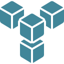

  

<h1 align="center">FleetOps</h1>

FleetOps is an end-to-end logistics management platform designed to simplify and streamline delivery operations for businesses of all sizes.  
It allows companies to efficiently manage deliveries, drivers, and payments from a single dashboard.  
With its Real-Time Vehicle Tracking system, businesses gain full visibility over their fleet, ensuring faster and more reliable deliveries.  
FleetOps also provides automated payment handling, reducing errors and saving valuable time for finance teams.  
The platform comes with advanced analytics and reporting tools to help optimize routes, cut down fuel costs, and improve overall efficiency.  
Scalable and secure, FleetOps is built to support growing businesses and adapt to their changing logistics needs.  
Whether you run a small delivery service or a large enterprise fleet, FleetOps makes logistics smarter, faster, and more transparent.

